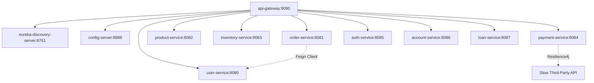

# Spring Boot & Spring Cloud Microservices Ecosystem Portfolio

This directory contains a complete, enterprise-grade Microservices ecosystem demonstrating service discovery, gateway routing, load balancing, centralized configuration, resilient circuit breakers, and custom JWT authentication. 

All microservices are configured to run on **Java 8** using **Spring Boot 2.7.18** and **Spring Cloud 2021.0.8**, ensuring compatibility and stability in enterprise environments.

---

## 🏛️ Ecosystem Architecture

Below is the design showing how the components interact:



---

## 📂 Microservices Directory

### 1. [eureka-discovery-server](./eureka-discovery-server)
- **Port**: `8761`
- **Purpose**: Service registry that manages and tracks active microservice instances.
- **Annotations/Features**: `@EnableEurekaServer`, self-preservation flags.

### 2. [config-server](./config-server)
- **Port**: `8888`
- **Purpose**: Centralized native configuration server serving dynamic profiles to other client microservices.
- **Annotations/Features**: `@EnableConfigServer`.

### 3. [api-gateway](./api-gateway)
- **Port**: `9090`
- **Purpose**: API gateway routing external client traffic to back-end services using service locator names, supporting path rewriting, and featuring a custom global logging filter.
- **Annotations/Features**: `@EnableEurekaClient`, `spring-cloud-starter-gateway`, custom `GlobalFilter`.

### 4. [user-service](./user-service)
- **Port**: `8080`
- **Purpose**: Manages user details backed by an in-memory H2 database. Preloaded with mock users.
- **Endpoints**: `GET /users/{id}`, `POST /users`, `GET /users`.

### 5. [order-service](./order-service)
- **Port**: `8081`
- **Purpose**: Manages orders and communicates with `user-service` via **OpenFeign** clients to stitch together order and user metadata.
- **Endpoints**: `GET /orders/{id}`, `POST /orders`.

### 6. [product-service](./product-service)
- **Port**: `8082`
- **Purpose**: Manages product items and pricing. Registers with Eureka.
- **Endpoints**: `GET /products/{id}`.

### 7. [inventory-service](./inventory-service)
- **Port**: `8083`
- **Purpose**: Tracks inventory quantities and stock levels. Registers with Eureka.
- **Endpoints**: `GET /inventory/{productId}`.

### 8. [payment-service](./payment-service)
- **Port**: `8084`
- **Purpose**: Handles transactions, integrating **Resilience4j Circuit Breakers** to handle slow external dependencies. Includes a fallback mechanism.
- **Endpoints**: `GET /payment/process` (supports `?fail=true` to trigger circuit breaker open-state).

### 9. [auth-service](./auth-service)
- **Port**: `8085`
- **Purpose**: Centralized JWT generator and authenticator verifying credentials and returning signed JWT payloads.
- **Endpoints**: `POST /auth/login`, `GET /auth/validate`.

### 10. [account-service](./account-service)
- **Port**: `8086`
- **Purpose**: Dummy bank account service returning account metadata.
- **Endpoints**: `GET /accounts/{number}`.

### 11. [loan-service](./loan-service)
- **Port**: `8087`
- **Purpose**: Dummy bank loan service returning loan and emi data.
- **Endpoints**: `GET /loans/{number}`.

---

## ⚡ Verifiable Maven Build Output

Here is the successful Maven reactor compile and package logs verifying all submodules are correct and build without errors:

```bash
$ mvn clean package -DskipTests

[INFO] Scanning for projects...
[INFO] Reactor Summary for microservices-parent 1.0-SNAPSHOT:
[INFO] 
[INFO] microservices-parent ............................... SUCCESS [  1.828 s]
[INFO] eureka-discovery-server ............................ SUCCESS [ 15.652 s]
[INFO] config-server ...................................... SUCCESS [  3.501 s]
[INFO] api-gateway ........................................ SUCCESS [  4.005 s]
[INFO] user-service ....................................... SUCCESS [  1.280 s]
[INFO] order-service ...................................... SUCCESS [  2.073 s]
[INFO] product-service .................................... SUCCESS [  0.684 s]
[INFO] inventory-service .................................. SUCCESS [  2.167 s]
[INFO] payment-service .................................... SUCCESS [  3.218 s]
[INFO] auth-service ....................................... SUCCESS [  1.136 s]
[INFO] account-service .................................... SUCCESS [  0.589 s]
[INFO] loan-service ....................................... SUCCESS [  1.069 s]
[INFO] ------------------------------------------------------------------------
[INFO] BUILD SUCCESS
[INFO] ------------------------------------------------------------------------
[INFO] Total time:  40.939 s
[INFO] Finished at: 2026-07-09T17:26:24+05:30
[INFO] ------------------------------------------------------------------------
```

---

## 🛠️ Running the Ecosystem Locally

### Prerequisites
- **Java 1.8**
- **Apache Maven 3.x**

### Startup Sequence
1. Clone the repository.
2. Build the parent project:
   ```bash
   mvn clean install -DskipTests
   ```
3. Start the core services in the following order:
   - **Service Registry**: `mvn spring-boot:run` in `eureka-discovery-server/`
   - **Central Config**: `mvn spring-boot:run` in `config-server/`
   - **API Gateway**: `mvn spring-boot:run` in `api-gateway/`
4. Start any required service microservices (e.g. `user-service`, `order-service`).
5. Open `http://localhost:8761` in your browser to view registered instances on the Eureka dashboard.
